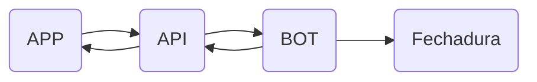
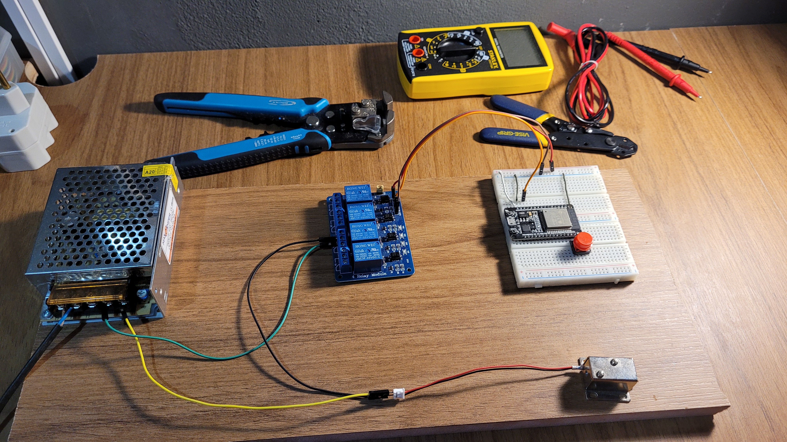

# Fechadura Moisés

Area: Estudos
Created time: January 16, 2023 3:59 PM
Last edited time: January 16, 2023 4:40 PM
Status: Esperando
Type: Documentação

# Overview do projeto Moisés

# Objetivo

<aside>
🔎 Aplicação capaz de realizar o controle de espaços compartilhados ( salas de informática, coworking, etc )

</aside>

# Componentes

- ESP-32
- Botão
- Fechadura de 12V
- Fonte Chaveada de 12V
- Relé
- Jumpers

# Funcionamento

A Fechadura Moisés foi construída para funcionar tal qual um servidor com duas rotas possíveis

- `/abrir`
- `/fechar`

Além disso, há também um botão para abrir a fechadura independente de qualquer requisição